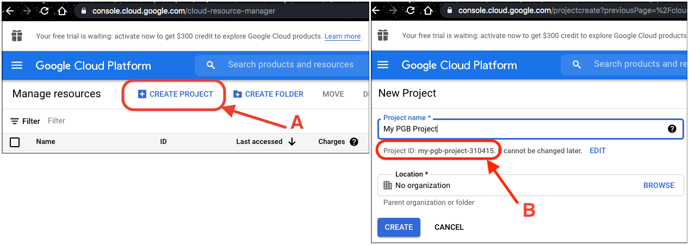
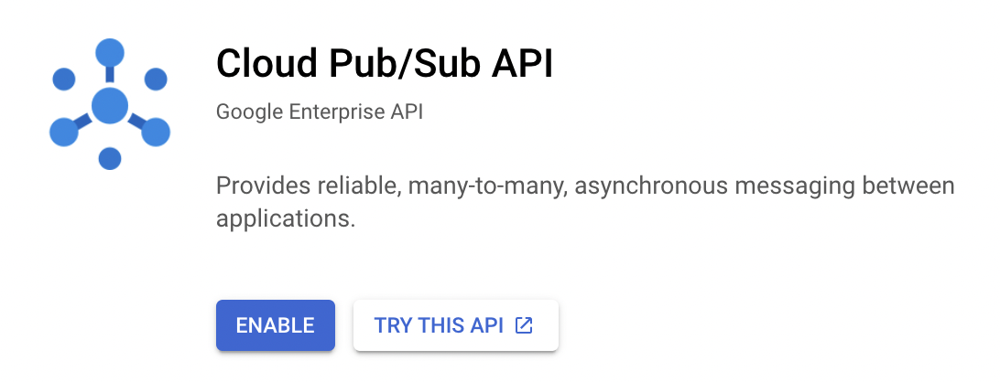

# Pub/Sub Tutorial
- [Initial Setup](#initial-setup)
    - [Command line](#command-line)
    - [Console](#console)
- [Create a subscription](#create-a-subscription)  
- [Pull Messages](#pull-messages)

## Initial Setup
<!-- fs -->
This process only needs to be done once per project/local machine.

The basic steps are:
1. Create a new project on Google Cloud Platform (GCP).
2. Enable the Pub/Sub API on your project.
3. Configure authentication on your local (or wherever) machine.
    - 3a. Create a service account for your new project and download a key file.
    - 3b. Set environment variables.
4. Install the Python API for Pub/Sub

You can do everything directly from the [command line](#command-line), or you can use the [Console](#console) GUI for the GCP setup.

### Command line:

```bash
# choose your GCP Project ID (it must be unique, so at least add a number here)
PROJECT_ID=my-pgb-project
# choose a name for your service account
NAME=mypgb-service-account
# choose a location for your key file
KEY_PATH=/local/path/for/GCP_auth_key.json

# install the SDK for the command line
    # Linux and MacOS:
curl https://sdk.cloud.google.com | bash
    # Windows:
    # see https://cloud.google.com/sdk/docs/downloads-interactive#windows
# follow the directions

# open a new terminal or restart your shell
# exec -l $SHELL

# connect gcloud to the Google account you want to use (assumes you have one already)
gcloud init
gcloud auth login
# this will open a browser and prompt you for authorization. follow the instructions

# create the project, set it as the gcloud default, and enable the Pub/Sub API
gcloud projects create $PROJECT_ID
gcloud config set project $PROJECT_ID
gcloud services enable pubsub.googleapis.com

# create an owner service account and download a key file
gcloud iam service-accounts create $NAME
gcloud projects add-iam-policy-binding $PROJECT_ID --member="serviceAccount:$NAME@$PROJECT_ID.iam.gserviceaccount.com" --role="roles/owner"
gcloud iam service-accounts keys create $KEY_PATH --iam-account=$NAME@$PROJECT_ID.iam.gserviceaccount.com

# set environment variables
export GOOGLE_CLOUD_PROJECT=$PROJECT_ID
export GOOGLE_APPLICATION_CREDENTIALS=$KEY_PATH

# install Pub/Sub Python API
pip install google-cloud-pubsub

# if you would like to delete the project with you are done, use:
# gcloud projects delete $PROJECT_ID
```

### Console:

1. Go to the [Cloud Resource Manager](https://console.cloud.google.com/cloud-resource-manager) and login with a Google account.
Click "Create Project" (A).
Enter a project name and write down the project ID (B) for the following code.
Click "Create".
(If you would like to delete your project when you are done: Go to the Cloud Resource Manager, select your project, and click "DELETE".)



2. Go to the [Cloud Pub/Sub API](https://console.cloud.google.com/apis/library/pubsub.googleapis.com) page and click "Enable".
(You may need to select your project from the dropdown.)



3. Follow the instructions at [Creating a service account](https://cloud.google.com/docs/authentication/getting-started#creating_a_service_account) to create a service account and download the key file for authentication.

Set your environment variables:
```bash
# insert your project ID from step 1:
PROJECT_ID=my-pgb-project
# insert the path to the key file you downloaded
KEY_PATH=/local/path/to/GCP_auth_key.json

export GOOGLE_CLOUD_PROJECT=$PROJECT_ID
export GOOGLE_APPLICATION_CREDENTIALS=$KEY_PATH
```

4. Install the Pub/Sub Python API: `pip install google-cloud-pubsub`

<!-- fe -->


## Create a subscription

Note: Only messages (alerts) published to the topic _after_ the subscription was created will be accessible.

__Command line:__
```bash
# create the subscription
TOPIC="ztf-loop"
SUBSCRIPTION="ztf-loop"  # choose a name for your subscription
gcloud pubsub subscriptions create $SUBSCRIPTION --topic=$TOPIC --topic-project="ardent-cycling-243415"
```
See also:
- [Quickstart using the gcloud command-line tool](https://cloud.google.com/pubsub/docs/quickstart-cli)

__Python:__
```python
# from google.cloud import pubsub_v1
# import os
from pgb_utils import pubsub as pgbps


# create the subscription. this only needs to be done once
topic = 'ztf-loop'
subscription = pgbps.subscribe(topic)
# my_project = os.getenv('GOOGLE_CLOUD_PROJECT')
# pgb_project = 'ardent-cycling-243415'
# subscription = 'ztf_alerts_pure'
# topic = 'ztf_alerts_pure'
# subscriber = pubsub_v1.SubscriberClient()
# publisher = pubsub_v1.PublisherClient()
# sub_path = subscriber.subscription_path(my_project, subscription)
# topic_path = publisher.topic_path(pgb_project, topic)
# subscriber.create_subscription(sub_path, topic_path)
```


## Pull Messages

__Command line:__
```bash
SUBSCRIPTION="ztf-loop"
limit=1  # default=1
gcloud pubsub subscriptions pull $SUBSCRIPTION --auto-ack --limit=$limit
```
See also:
- [Quickstart using the gcloud command-line tool](https://cloud.google.com/pubsub/docs/quickstart-cli)
- [gcloud pubsub subscriptions pull](https://cloud.google.com/sdk/gcloud/reference/pubsub/subscriptions/pull)

__Python:__
```python
# from google.cloud import pubsub_v1
# import os
from pgb_utils import pubsub as pgbps

subscription = 'ztf-loop'

# pull messages
msgs = pgbps.pull(subscription)
df = pgbps.decode_ztf_alert(msgs[0], return_format='df')


# streaming pull messages
def callback(message):
    # process here
    df = pgbps.decode_ztf_alert(message.data, return_format='df')
    print(df.head(1))
    message.ack()

pgbps.streamingPull(subscription, callback, timeout=4)
```

See also:
- [Subscriber Client API](https://googleapis.dev/python/pubsub/1.7.0/subscriber/api/client.html)


## Process messages using Dataflow

```python

with beam.Pipeline() as pipeline:
    (
        pipeline
        | 'Read BigQuery' >> beam.io.ReadFromBigQuery(**read_args)
        | 'Type cast to DataFrame' >> beam.ParDo(pgb.beam.ExtractHistoryDf())
        | 'Is nearby known SS object' >> beam.Filter(nearby_ssobject)
        | 'Calculate mean magnitudes' >> beam.ParDo(calc_mean_mags())
        | 'Write results' >> beam.io.WriteToText(beam_outputs_prefix)
    )
```
