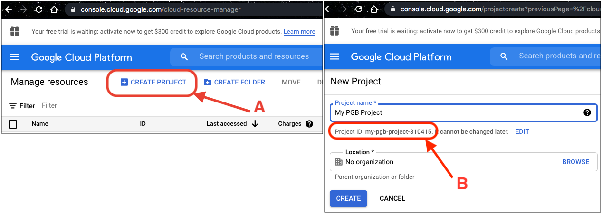

# Initial Setup of Google Cloud and a Local Environment

- [Create a GCP Project](#create-a-gcp-project)
- [Setup Local Environment](#setup-local-environment)

## Create a GCP Project

Create a new Google Cloud Platform (GCP) project.
- A. Go to the [Cloud Resource Manager](https://console.cloud.google.com/cloud-resource-manager) and click "Create Project".
- B. Write down your Project ID as you will need it at various points.
- C. Click "Create".

See [Creating and managing projects](https://cloud.google.com/resource-manager/docs/creating-managing-projects) for more information, including instructions for creating a project programatically.




## Setup Local Environment

Broker instances _run_ 100% in the Google Cloud, as determined by the code in the `broker` package.
You can _develop_ the code and/or _deploy_ an instance to the Cloud from your local machine. Setup your environment as follows:

1. Install Google Cloud SDK command-line tools using one of the following options. Included tools: `gcloud`, `gsutil`, and `bq`. Version 323.0.0 or above is recommended.
    - [install from the command line](https://cloud.google.com/sdk/docs/downloads-interactive)
    - [download the package](https://cloud.google.com/sdk/docs/install)

1b. You may need to authenticate `gcloud` using the code below. You may be asked to re-authenticate occasionally in the future.

```bash
PROJECT_ID=my-pgb-project  # replace with your GCP Project ID

gcloud auth login  # follow the instructions to login to GCP
gcloud config set project $PROJECT_ID  # set your project ID
```

2. Install Python libraries for [GCP services](https://cloud.google.com/python/docs/reference) and other tools such as Pandas, Astropy, etc. as needed.
You can install packages individually, or use the [`requirements.txt`](../../../requirements.txt) file. The following code creates a new [Conda](https://www.anaconda.com/) environment and installs the requirements.
(I, Troy, suggest we have people install the `pgb-utils` package instead, but its requirements are currently optimized for Colab and need to be reconfigured.)

```bash
# create a Conda environment (optional)
conda create -n pgb python=3.7
conda activate pgb

# install the requirements. assumes txt file is in current directory
pip3 install -r requirements.txt
```

__Note__: On an M1 Mac, first use Conda to install Astropy (`conda install astropy=3.2.1`), then comment the related line out of the requirements file before doing `pip install`.


3. Create a GCP service account and download a key file for authentication using the following code. See [Getting started with authentication](https://cloud.google.com/docs/authentication/getting-started) for more information.

```bash
PROJECT_ID=my-pgb-project  # replace with your GCP Project ID
NAME=my-service-account  # replace with desired account name
KEY_PATH=local/path/GCP_auth_key.json  # replace with desired path (ending in .json)

gcloud iam service-accounts create $NAME
gcloud projects add-iam-policy-binding $PROJECT_ID --member="serviceAccount:$NAME@$PROJECT_ID.iam.gserviceaccount.com" --role="roles/owner"
gcloud iam service-accounts keys create $KEY_PATH --iam-account=$NAME@$PROJECT_ID.iam.gserviceaccount.com
```

4. Set environment variables

```bash
PROJECT_ID=my-pgb-project  # replace with your GCP Project ID
KEY_PATH=local/path/GCP_auth_key.json  # same path as in step 3

export GOOGLE_CLOUD_PROJECT="$PROJECT_ID"
export GOOGLE_APPLICATION_CREDENTIALS="$KEY_PATH"
```

If you are using a Conda environment, you can configure the environment variables as follows:

```bash
PROJECT_ID=my-pgb-project  # replace with your GCP Project ID
KEY_PATH=local/path/for/key/file.json  # same path as in step 3

# log into the environment and create de/activate files
conda activate pgb
cd $CONDA_PREFIX
mkdir -p ./etc/conda/activate.d
mkdir -p ./etc/conda/deactivate.d
touch ./etc/conda/activate.d/env_vars.sh
touch ./etc/conda/deactivate.d/env_vars.sh

# add environment variables
echo "export GOOGLE_CLOUD_PROJECT='$PROJECT_ID'" >> ./etc/conda/activate.d/env_vars.sh
echo "export GOOGLE_APPLICATION_CREDENTIALS='$KEY_PATH'" >> ./etc/conda/activate.d/env_vars.sh
echo 'unset GOOGLE_CLOUD_PROJECT' >> ./etc/conda/deactivate.d/env_vars.sh
echo 'unset GOOGLE_APPLICATION_CREDENTIALS' >> ./etc/conda/deactivate.d/env_vars.sh
```

5. Check that your authentication works by making an API request.
Here we request a list of Cloud Storage buckets (in Python):

```python
from google.cloud import storage

storage_client = storage.Client()
# Make an authenticated API request
buckets = list(storage_client.list_buckets())
# If the request succeeded, your authentication works
print(buckets)  # this list may be empty if you haven't created any buckets yet
```
