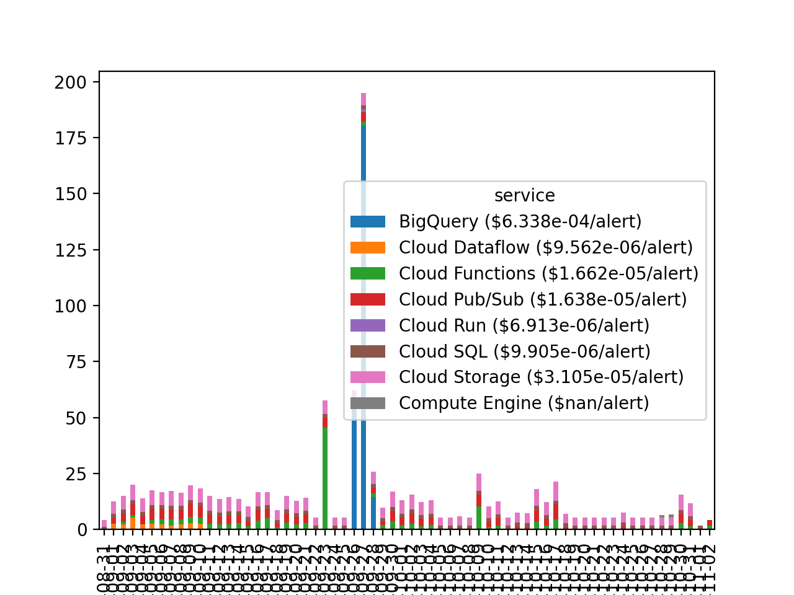

# billing: pitt-google-broker-billing

- [Export Cloud Billing data to BigQuery](https://cloud.google.com/billing/docs/how-to/export-data-bigquery)

- Billing project:
    - Name: pitt-google-broker-billing
    - ID: light-cycle-328823
- Billing account: 0102E2-E3A6BA-C2AFD5

(skip to [Run queries and make figures](#run-queries-and-make-figures) )

## Setup: Create a new service account

```bash

NAME="tjraen-owner"
PROJECT_ID="light-cycle-328823"
FILE_NAME="/Users/troyraen/Documents/broker/repo/GCP_auth_key-broker_billing.json"

gcloud init
# gcloud config set compute/region us-central1
# gcloud config set compute/zone ZONE us-central1-a

gcloud iam service-accounts create "$NAME"
gcloud projects add-iam-policy-binding "$PROJECT_ID" \
    --member="serviceAccount:${NAME}@${PROJECT_ID}.iam.gserviceaccount.com" \
    --role="roles/owner"
gcloud iam service-accounts keys create "$FILE_NAME" \
    --iam-account="${NAME}@${PROJECT_ID}.iam.gserviceaccount.com"
```

## Run queries and make figures

```bash
pip install --upgrade pyarrow
pip uninstall pyarrow
pip install pyarrow==0.17.1
```

```python
import os
from matplotlib import pyplot as plt
from broker_utils import gcp_utils
import queries

project_id = os.getenv('GOOGLE_CLOUD_PROJECT')  # ardent-cycling-243415
billing_project_id = os.getenv('GOOGLE_CLOUD_PROJECT2')  # light-cycle-328823

# billdf
lookback = 90
query, job_config = queries.billing(lookback=lookback)
billdf = gcp_utils.query_bigquery(
    query, job_config=job_config, project_id=billing_project_id
).to_dataframe()
# billdf['ssku'] = billdf.apply(lambda row: f"{row['service']}: {row['sku']}", axis=1)

# cost per alert
query, job_config = queries.count_metadata_by_date(lookback=lookback)
countdf = gcp_utils.query_bigquery(
    query, job_config=job_config, project_id=project_id
).to_dataframe()
countdf.set_index('publish_date', inplace=True)
# date = "2021-08-31"
# ddate = datetime.datetime.strptime(date, "%Y-%m-%d").date()
def calc_avg_cost(column):
    per_alert = column/countdf['num_alerts']  # 1 row per day
    return per_alert.dropna().mean()
per_alert = df.apply(calc_avg_cost, axis=0)

# plot
project_id = 'ardent-cycling-243415'
gb = ['usage_date', 'service']
df = billdf.loc[billdf['project_id']==project_id, gb+['cost']].groupby(gb).sum()
df = df.reset_index().pivot(index='usage_date', columns='service', values='cost')
df = df[df > 1.0].dropna(axis=1, how='all')  # drop cols where all < $1.00
def rename_column(colname):
    return f"{colname} (${per_alert[colname]:.3e}/alert)"
df = df.rename(rename_column, axis=1)
df.plot.bar(stacked=True)
plt.savefig('billing.png')
plt.show(block=False)
```




## OLD

```python
date = "2021-10-09"
query, job_config = queries.billing(date=date)
billdf = gcp_utils.query_bigquery(
    query, job_config=job_config, project_id=billing_project_id
).to_dataframe()

query, job_config = queries.count_alerts_by_date(date=date)
acountdf = gcp_utils.query_bigquery(
    query, job_config=job_config, project_id=project_id
).to_dataframe()

# cost per alert
num_alerts = countdf.loc[countdf['date'].astype(str)==date, 'num_alerts'].iloc[0]

service_costs = billdf[['service','cost']].groupby('service').sum()
service_costs['cost_per_alert'] = service_costs['cost'] / num_alerts

cf_costs = billdf.loc[billdf['service']=="Cloud Functions", ['sku','cost']].groupby('sku').sum()
cf_costs['cost_per_alert'] = cf_costs['cost'] / num_alerts

# date = "2021-10-09"
# query, job_config = queries.count_alerts_by_date(date=date, lookback=None)
# count9df = gcp_utils.query_bigquery(
#     query, job_config=job_config, project_id=project_id
# ).to_dataframe()
```
