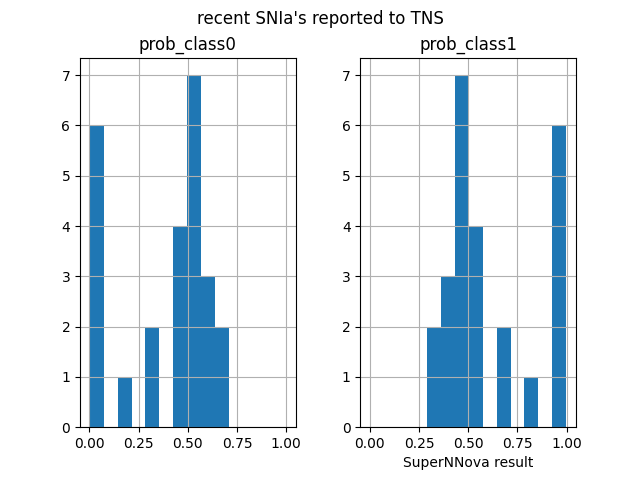

# SuperNNova validation: Classify known Ia's

1. Download csv from TNS website. ([Search](https://www.wis-tns.org/search) for recent
   Ia's)
1. Query database to see what SNN classified these as

The docs indicate that "usually" class0 indicates a Ia and class1 indicates non-Ia, but
this will depend on how the model was trained.

I checked by classifying a objects recently reported to TNS as Ias.

Results indicate the opposite of expected. Will check with Anais.

```python
import matplotlib.pyplot as plt
import os
import pandas as pd
from broker_utils import gcp_utils

# get objectIds from TNS csv
f = "tns_search_SNIa.csv"
df = pd.read_csv(f)
ztfdf = df.loc[df["Disc. Internal Name"].str.startswith("ZTF")]
objectIds = list(ztfdf["Disc. Internal Name"].unique())

# query bigquery
project_id = os.getenv("GOOGLE_CLOUD_PROJECT")
dataset = "ztf_alerts"
table = "SuperNNova"
query = f"""
    SELECT *
    FROM `{project_id}.{dataset}.{table}`
    WHERE objectId IN ('{"','".join(objectIds)}')
"""
bqdf = gcp_utils.query_bigquery(query).to_dataframe()
cleandf = bqdf.sort_values("candid", ascending=False).drop_duplicates(
    subset="objectId", keep="first"
)

date = "20211017"
fout = f"snn_results_{date}.png"
cleandf.hist(["prob_class0", "prob_class1"], sharex=True)
plt.xlabel("SuperNNova result")
plt.suptitle("recent SNIa's reported to TNS")
plt.savefig(fout)
plt.show(block=False)
```



### Classify known Ia - Original Test

The docs indicate that "usually" class0 indicates a Ia and class1 indicates non-Ia, but
this will depend on how the model was trained.

I (Troy) checked by classifying a recent observation of the known Ia that I recently
pulled from file storage to send to Ella (SN_2021rhu aka ZTF21abiuvdk,
[ZTF21abiuvdk_lightcurve.png](ZTF21abiuvdk_lightcurve.png) and compare with
[Alerce](https://alerce.online/object/ZTF21abiuvdk)).

Results indicate the opposite of expected... SN_2021rhu is assigned to class1 with high
confidence.

Adding this to my list of questions for Anais about the trained model.

```python
import main
from broker_utils import data_utils, gcp_utils

snIa = "ZTF21abiuvdk"
fname = "/Users/troyraen/Documents/broker/ella/avros/ZTF21abiuvdk.1664460940815015004.ztf_20210723_programid1.avro"

alert_dict = data_utils.decode_alert(fname)
snn_dict = main.classify_with_snn(alert_dict)
snn_dict
# output is:
{
    "objectId": "ZTF21abiuvdk",
    "candid": 1664460940815015004,
    "prob_class0": 0.04458457976579666,
    "prob_class1": 0.9554154872894287,
    "pred_class": 1,
}
```

Again on Sept 5 with all observations

```python
import main
import os
import pandas as pd
from broker_utils import data_utils, gcp_utils, schema_maps

schema_map = schema_maps.load_schema_map("ztf", False)

snIa = "ZTF21abiuvdk"
bucketid = "ztf-alert_avros"
localdir = f"/Users/troyraen/Documents/broker/troy/troy/SNN/{snIa}"
gcp_utils.cs_download_file(snIa, bucketid, localdir)

dfs = []
for f in os.listdir(localdir):
    dfs.append(data_utils.decode_alert(f"{localdir}/{f}", "df", schema_map))
df = pd.concat(dfs)

model_path = "/Users/troyraen/Documents/broker/snn/broker/cloud_functions/classify_snn/ZTF_DMAM_V19_NoC_SNIa_vs_CC_forFink/vanilla_S_0_CLF_2_R_none_photometry_DF_1.0_N_global_lstm_32x2_0.05_128_True_mean.pt"
# step through the formatting and classification from cloud fnc main.py
snn_dict
# output is:
{
    "objectId": "ZTF21abiuvdk",
    "candid": 1707409520815015012,
    "prob_class0": 0.010303422808647156,
    "prob_class1": 0.9896966218948364,
    "predicted_class": 1,
}
```
