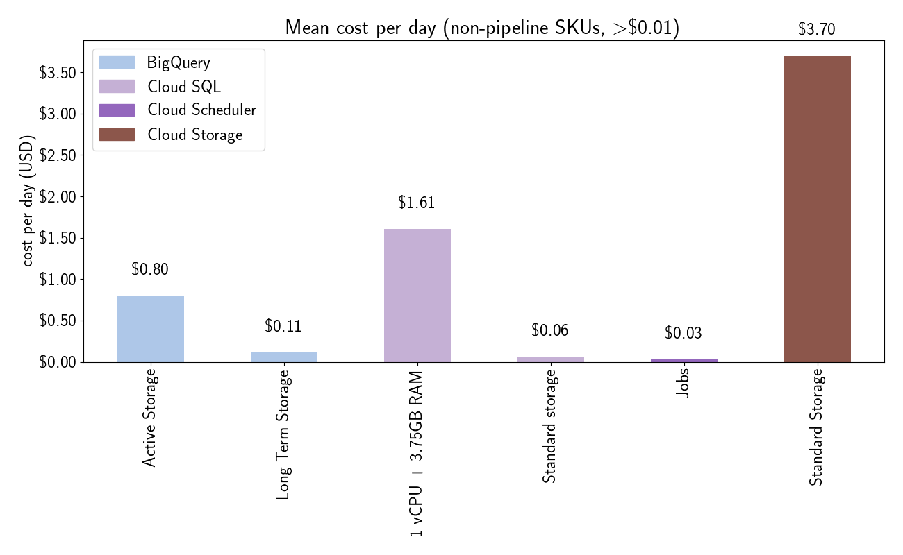
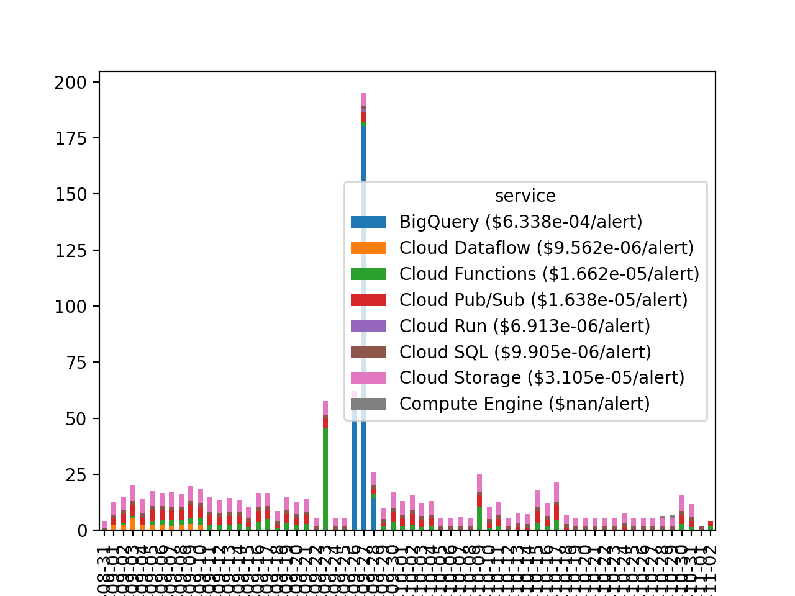

# billing: pitt-google-broker-billing

- [Export Cloud Billing data to BigQuery](https://cloud.google.com/billing/docs/how-to/export-data-bigquery)

- Billing project:
    - Name: pitt-google-broker-billing
    - ID: light-cycle-328823
- Billing account: 0102E2-E3A6BA-C2AFD5

## Setup: Set environment variables

```bash
# project ids, used to create/manage service accounts, and make queries on the tables
export GOOGLE_CLOUD_PROJECT="light-cycle-328823"        # billing project
export GOOGLE_CLOUD_PROJECT2="ardent-cycling-243415"    # production project

# set the following to a local path where the billing service account credentials
# key file will be downloaded to (upon creation) and/or accessed from (queries)
export GOOGLE_APPLICATION_CREDENTIALS="<path/to/credentials/keyfile.json"
# export GOOGLE_APPLICATION_CREDENTIALS="/Users/troyraen/Documents/broker/Pitt-Google/repo/GCP_auth_key-broker_billing_bigquery.json"
# export GOOGLE_APPLICATION_CREDENTIALS="/Users/troyraen/Documents/broker/Pitt-Google/repo/GCP_auth_key-broker_billing.json"

# billing service account that will be used to make queries
SERVICE_ACCOUNT_NAME="tjraen-bigquery"
# SERVICE_ACCOUNT_NAME="tjraen-owner"
SERVICE_ACCOUNT="${SERVICE_ACCOUNT_NAME}@${GOOGLE_CLOUD_PROJECT}.iam.gserviceaccount.com"
```

## Setup: Create a new service account that can query the billing BigQuery tables

- https://cloud.google.com/iam/docs/creating-managing-service-accounts#iam-service-accounts-create-gcloud
- https://cloud.google.com/iam/docs/creating-managing-service-account-keys
- https://cloud.google.com/iam/docs/understanding-roles
<!-- - https://cloud.google.com/iam/docs/granting-changing-revoking-access
- https://cloud.google.com/iam/docs/manage-access-other-resources
    - bigquery has a separate sdk: https://cloud.google.com/bigquery/docs/reference/bq-cli-reference#bq_add-iam-policy-binding
- https://cloud.google.com/iam/docs/understanding-roles#predefined
- https://cloud.google.com/sdk/gcloud/reference/resource-manager -->


```bash
# To run this, you must have a user account (e.g. a Gmail address)
# that has access to the billing project.
gcloud init
# follow prompts and connect to the billing project

# later, you can reactivate this configuration with
#     gcloud config configurations activate <billing-project>
# where <billing-project> is the name you assigned to the configuration during init

# create the service account
gcloud iam service-accounts create "$SERVICE_ACCOUNT_NAME"

# assign the service account a role on the billing account
role="roles/bigquery.resourceViewer"
# role="roles/owner"
gcloud projects add-iam-policy-binding "$GOOGLE_CLOUD_PROJECT" \
    --member="serviceAccount:${SERVICE_ACCOUNT}" \
    --role="roles/owner"

# create and download an auth key file
gcloud iam service-accounts keys create "$GOOGLE_APPLICATION_CREDENTIALS" \
    --iam-account="$SERVICE_ACCOUNT"
```

This service account will have permission to query the production dataset/table
because those resources are public access.

<!-- ```bash
gcloud components update

# received:
# Update done!
#
# To revert your SDK to the previously installed version, you may run:
gcloud components update --version 348.0.0
``` -->

## Setup for queries and plotting

```bash
# navigate to this directory (replace with your path)
cd /Users/troyraen/Documents/broker/Pitt-Google/troy/docs/source/working-notes/troyraen/billing

# activate the billing service account, if it's not already:
gcloud auth activate-service-account \
    --project="$GOOGLE_CLOUD_PROJECT" \
    --key-file="$GOOGLE_APPLICATION_CREDENTIALS"

# pip install --upgrade pyarrow
# pip uninstall pyarrow
# pip install pyarrow==0.17.1
```

```python
import datetime
import importlib as imp
import os
import pandas as pd
from matplotlib import pyplot as plt
from broker_utils import gcp_utils

import figures
import queries
import transforms

billing_project_id = os.getenv('GOOGLE_CLOUD_PROJECT', 'light-cycle-328823')
prod_project_id = os.getenv('GOOGLE_CLOUD_PROJECT2', 'ardent-cycling-243415')
```

## Query tables or load dataframes from files

```python
# load billdf
f = 'billing_20211203.csv'  # all billing data in the table as of 12/3/2021
billdf = pd.read_csv(f)
billdf['usage_date'] = pd.to_datetime(billdf.usage_date, format='%Y-%m-%d').dt.date
# ALTERNATELY, run a new query to load billdf
lookback = 180
query, job_config = queries.billing(lookback=lookback)
billdf = gcp_utils.query_bigquery(
    query, job_config=job_config, project_id=billing_project_id
).to_dataframe()

# create a lightened billdf containing only what we want to look at
lite_df_cols = ['project_id', 'service', 'sku', 'cost', 'usage_date']
litebilldf = billdf.loc[:, lite_df_cols]
# get indexes where the sku is a live pipeline sku
litebill_ispipelinesku = (litebilldf.apply(transforms.is_pipeline_sku, axis=1))

# load alert counts per day
f = "alert_counts_20211203.csv"
countdf1 = pd.read_csv(f)
f = "alert_counts_fill_missing_20211203.csv"
countdf2 = pd.read_csv(f, comment="#")
countdf = pd.concat([countdf1, countdf2])
countdf['publish_date'] = pd.to_datetime(countdf.publish_date, format='%Y-%m-%d').dt.date
# ALTERNATELY, run a new query on the ztf metadata table
query, job_config = queries.count_metadata_by_date(lookback=lookback)
countdf = gcp_utils.query_bigquery(
    query, job_config=job_config, project_id=billing_project_id
).to_dataframe()
```

## Look at countdf

```python
countdf = countdf.set_index('publish_date').sort_index()

# look at the data
countdf.plot.bar()
plt.show(block=False)

```

## Live pipeline: Bar chart of average cost per sku per million alerts, colored by service

```python
# keep rows where project and sku => live pipeline
mylite_df_indexes = (litebill_ispipelinesku) & (litebilldf["project_id"] == prod_project_id)
mylitebilldf = litebilldf.loc[mylite_df_indexes]

# remove dates where abnormal things happened affecting costs
remove_dates = [
    # ZTF dumped alerts at LSST rates
    datetime.date(2021, 9, 23),
    # AllWISE crossmatch queried BigQuery for every alert
    datetime.date(2021, 9, 26),
    datetime.date(2021, 9, 27),
    datetime.date(2021, 9, 28),
]
mylitebilldf = mylitebilldf.loc[~mylitebilldf.usage_date.isin(remove_dates)]

# keep only dates with num_alerts > 0
mylitebilldf = mylitebilldf.set_index('usage_date').sort_index()
commondates = set(mylitebilldf.index).intersection(set(countdf.index))
indexes_to_keep = countdf.loc[(countdf.num_alerts>0) & (countdf.index.isin(commondates))].index
mylitebilldf = mylitebilldf.loc[indexes_to_keep]

# sum by sku and date
costdf_bydate = transforms.cost_by_sku(mylitebilldf.reset_index(), how='sum', bydate=True)

# calculate cost per million
costdf_bydate.set_index('usage_date', inplace=True)
costdf_bydate['cost_per_million_alerts'] = costdf_bydate.cost / countdf.loc[indexes_to_keep].num_alerts *1e6

# get average cost/million alerts
costdf = transforms.cost_by_sku(costdf_bydate, cost='cost_per_million_alerts', how='mean')
# keep only significant costs
costdf = costdf.loc[costdf.cost_per_million_alerts>0]

save = 'billing_per_sku_per_million_alerts.png'
title = "Mean cost per million alerts"
figures.plot_cost_by_sku(costdf, save=save, cost='cost_per_million_alerts', title=title)
```


## Not live pipeline: Bar chart of average cost per sku per day, colored by service

```python
# keep rows where sku => ~(live pipeline)
mylitebilldf = litebilldf.loc[~litebill_ispipelinesku]

# sum by sku and date, then take the mean
costdf_bydate = transforms.cost_by_sku(mylitebilldf.reset_index(), how='sum', bydate=True)
costdf = transforms.cost_by_sku(costdf_bydate, how='mean')

save = 'billing_per_sku_per_day.png'
title = "Mean cost per day"
figures.plot_cost_by_sku(costdf, save=save, title=title)
```



## Live pipeline, Cloud Run: Bar chart of average cost per sku per million alerts, colored by service

```python
# keep rows where project and sku => live pipeline and service is Cloud Run
mylite_df_indexes = (litebill_ispipelinesku) & (litebilldf["project_id"] == prod_project_id) & (litebilldf["service"] == "Cloud Run")
mylitebilldf = litebilldf.loc[mylite_df_indexes]

# keep only dates with num_alerts > 0
mylitebilldf = mylitebilldf.set_index('usage_date').sort_index()
commondates = set(mylitebilldf.index).intersection(set(countdf.index))
indexes_to_keep = countdf.loc[(countdf.num_alerts>0) & (countdf.index.isin(commondates))].index
mylitebilldf = mylitebilldf.loc[indexes_to_keep]

# sum by sku and date
costdf_bydate = transforms.cost_by_sku(mylitebilldf.reset_index(), how='sum', bydate=True)

# calculate cost per million alerts
costdf_bydate.set_index('usage_date', inplace=True)
costdf_bydate['cost_per_million_alerts'] = costdf_bydate.cost / countdf.loc[indexes_to_keep].num_alerts *1e6

# get average cost/million alerts
costdf = transforms.cost_by_sku(costdf_bydate, cost='cost_per_million_alerts', how='mean')
# keep only significant costs
costdf = costdf.loc[costdf.cost_per_million_alerts>0]

save = 'billing_per_sku_per_million_alerts_cloud_run.png'
title = "Mean cost per million alerts"
figures.plot_cost_by_sku(costdf, save=save, cost='cost_per_million_alerts', title=title)
```


## Stacked (services) bar chart of cost vs date

```python
mycostdf_bydateservice = litebilldf.groupby(['usage_date', 'service']).sum().reset_index()
mycostdf_bydate = mycostdf_bydateservice.pivot(index='usage_date', columns='service', values='cost')
mycostdf_bydate.fillna(0, inplace=True)

# cost bar chart
fig = plt.figure(figsize=(13,8))
ax = fig.gca()
mycostdf_bydate.plot.bar(stacked=True, ax=ax)

# annotate with number of alerts received
sum_day_cost = mycostdf_bydate.sum(axis=1)  # height of each stacked bar
y_offset = 5  # put space between bar and text
labels = tuple(f"{countdf.num_alerts.get(date, 0)} alerts" for date in mycostdf_bydate.index)
for i, (label, total) in enumerate(zip(labels, sum_day_cost)):
    ax.text(i, total + y_offset, label, ha='center', rotation='vertical')

plt.ylabel("Cost")
plt.savefig('billing_per_day_and_service.png')
plt.show(block=False)
```


## Bar chart of total cost per sku, colored by service

```python
import datetime


day = datetime.date(2021, 12, 2)
cols = ['service', 'sku', 'cost']
# litebilldf = billdf.loc[(billdf['usage_date']==day) & (billdf['project_id']==my_project), cols]
litebilldf = billdf.loc[billdf['project_id']==prod_project_id, cols]

save = 'billing_per_sku.png'
# sum costs, clean, and sort
costdf = transforms.sum_cost_by_sku(litebilldf)
figures.plot_cost_by_sku(costdf, save=None)
```


## Bar chart cost per day, (stack) services
```python
# plot
my_project = prod_project_id
gb = ['usage_date', 'service']
df = billdf.loc[billdf['project_id']==my_project, gb+['cost']].groupby(gb).sum()
df = df.reset_index().pivot(index='usage_date', columns='service', values='cost')
df = df[df > 1.0].dropna(axis=1, how='all')  # drop cols where all < $1.00
def rename_column(colname):
    return f"{colname} (${per_alert[colname]:.3e}/alert)"
df = df.rename(rename_column, axis=1)
df.plot.bar(stacked=True)
plt.savefig('billing_per_day.png')
plt.show(block=False)
```


