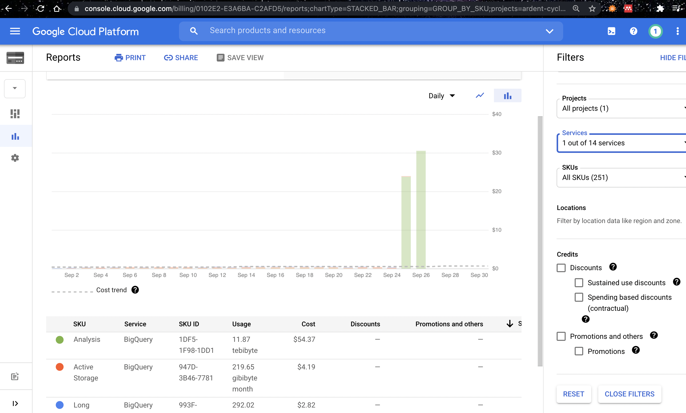

# AllWISE BigQuery cross match<a name="allwise-bigquery-cross-match"></a>

<!-- mdformat-toc start --slug=github --maxlevel=6 --minlevel=1 -->

- [AllWISE BigQuery cross match](#allwise-bigquery-cross-match)
  - [Billing](#billing)

<!-- mdformat-toc end -->

```python
from matplotlib import pyplot
import figures as figs

query = {
    "survey": "ztf",
    "testid": False,
    "date": "20210923",
    # 'limit': 100,
    "columns": [
        "kafka_timestamp__alerts",
        "publish_time__alerts",
        "publish_time__BigQuery",
        "publish_time__alert_avros",
        # 'publish_time__AllWISE',
        # 'publish_time__alerts_pure',
        "publish_time__exgalac_trans_cf",
        "publish_time__SuperNNova",
    ],
}
savefig_dir = "figures/20210923"
mplot = figs.MetadataPlotter(query=query, savefig_dir=savefig_dir)
# mplot = figs.MetadataPlotter(df=mplot.df, query=query, savefig_dir=savefig_dir)

# plot processing times with marginal histograms
cols = ["alerts", "BigQuery", "alert_avros", "exgalac_trans_cf", "SuperNNova"]
clip_first = 0
tref = "trigger"
# clip_first = 90
c = ["AllWISE"]
# t0 = ('publish_time__alerts', 'trigger')
# title = "Cross match with AllWISE BigQuery public dataset; Cloud Run"
for tref in ["kafka", "trigger"]:
    plot_proct()


def plot_proct():
    fig = plt.figure()
    gs = fig.add_gridspec(
        2,
        2,
        width_ratios=(7, 1.3),
        height_ratios=(2, 7),
        left=0.1,
        right=0.9,
        bottom=0.1,
        top=0.9,
        wspace=0.05,
        hspace=0.05,
    )

    ax = fig.add_subplot(gs[1, 0])
    marg_ax = {
        "x": fig.add_subplot(gs[0, 0], sharex=ax),
        "y": fig.add_subplot(gs[1, 1], sharey=ax),
    }
    mplot.plot_proc_time(c, ax, tref=tref, clip_first=clip_first, marg_ax=marg_ax)
    fig.autofmt_xdate()
    fig.suptitle(f"{c.split('__')[-1]}")
    # fig.suptitle(title)
    mplot._save_or_show(f"{c}-{tref}")
    if mplot.savefig_dir is not None:
        plt.close(fig)
```

## Billing<a name="billing"></a>



BigQuery billing after the first night (9/26), *before* 9/27 topic started. The first
night had errors that caused a backlog of ~20,000 alerts lasting a few hours. Sept 27
should be the first normal "night".
