# Pipeline Performance at approx. LSST rates - Sept 23, 2021

- [Overview](#overview)
- [Incoming alert info](#incoming-alert-info)
- [Component processing times](#component-processing-times)
- [Cloud Function execution](#cloud-function-execution)
- [Billing](#billing)

## Overview

On Sept 23, incoming alert rates were very high for the first \~10 minutes, close to expected LSST-scale.
Here I (Troy) document some aspects of how the pipeline performed.

The situation:
- ZADS (ZTF Alert Distribution System) was down for the first \~1.5 hours (\~90,000 alerts) of IPAC observing. When it came online, it dumped (sent) out the alert backlog in 5-10 minutes.
- On Sept. 22, we were charged ~10x more than normal for the Cloud Functions' CPU time (see [screenshot](#billing)). (Billing reports use Pacific timezone.)

Takeaways:
- Our *consumer* can handle the average alert rate expected from LSST (\~17,000 alerts/min). It takes us \~8 minutes to get the ZTF alert backlog into the *alerts* stream. It's hard to tell how long it takes ZADS to dump these alerts, so I don't really know what our consumer's latency was relative to our actual incoming alert rate.
- The *BigQuery* storage Cloud Function gets backed up; processing times for this component (non-cumulative) spike up to \~15 minutes.
- All other Cloud Functions seem to handle the high alert rate pretty well, with *SuperNNova* a possible exception.
- The execution time of an individual Cloud Function instance is higher when there are more simultaneous instances (i.e., incoming alert rate is higher). This seems strange to me. But it does explain the 10x billing increase (lots of instances with long execution times).
- The Cloud Functions that store to BigQuery (*BigQuery* and *SuperNNova*) experience a large number of timeouts (which then get retried) when the incoming rate is high. I assume we are hitting a rate limit for streaming inserts, but I haven't checked.
- The combination of many simultaneous Cloud Function instances and their large execution times results in high costs (>6x normal ZTF).

## Incoming alert info

- `kafka_timestamp` gets applied at IPAC.
- There is no timestamp applied at ZADS (to my knowledge). The best info about ZADS rates comes from their Grafana dashboard.
- Screenshots (times are Eastern). Notes:
    - Their "Incoming alert rate" reaches \~80,000/min. (IPAC -> ZADS)
    - Their outgoing alert rate is unknown. (ZADS -> brokers)
        - The "BytesOut Rate" is the closest indicator. Under normal circumstances, it is \~5x higher than the "BytesIn Rate".
        - So their outgoing alert rate probably peaks at <20,000 alerts/min.

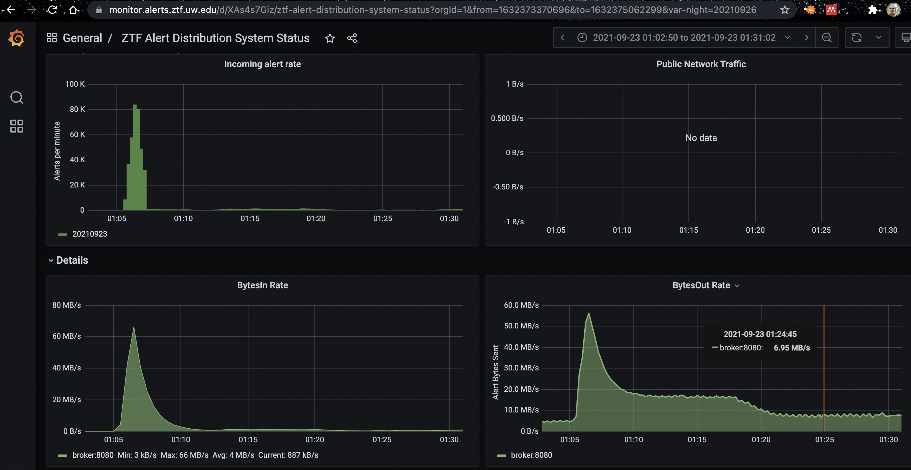

ZADS dashboard during the dump and shortly after.

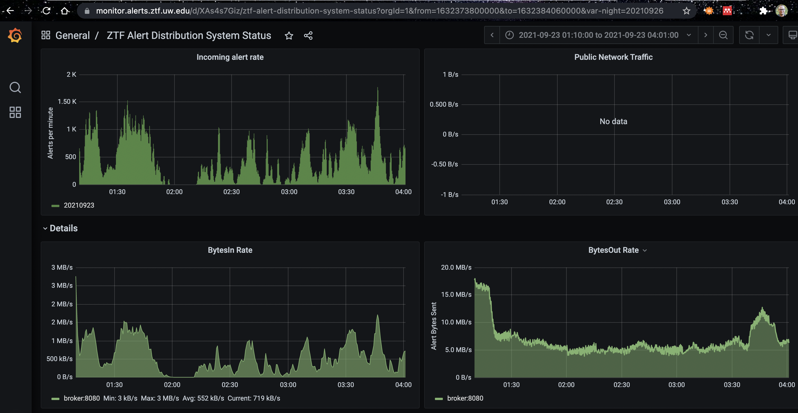

For reference. ZADS dashboard at the end of the dump (starting at 01:10) for the next few hours.

## Component processing times

__Takeaways:__
- Our *consumer* can handle the average alert rate expected from LSST (\~17,000 alerts/min). It takes us \~8 minutes to get the ZTF alert backlog into the *alerts* stream. It's hard to tell how long it takes ZADS to dump these alerts, so I don't really know what our consumer's latency was relative to our actual incoming alert rate.
- The *BigQuery* storage Cloud Function gets backed up; processing times for this component (non-cumulative) spike up to \~15 minutes.
- All other Cloud Functions seem to handle the high alert rate pretty well, with *SuperNNova* a possible exception.

__Figures:__

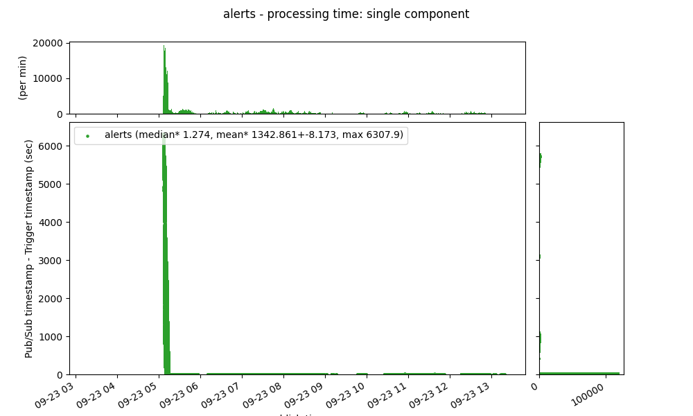

This delay comes from ZADS. The title "processing time" is a misnomer for the *alerts* stream.

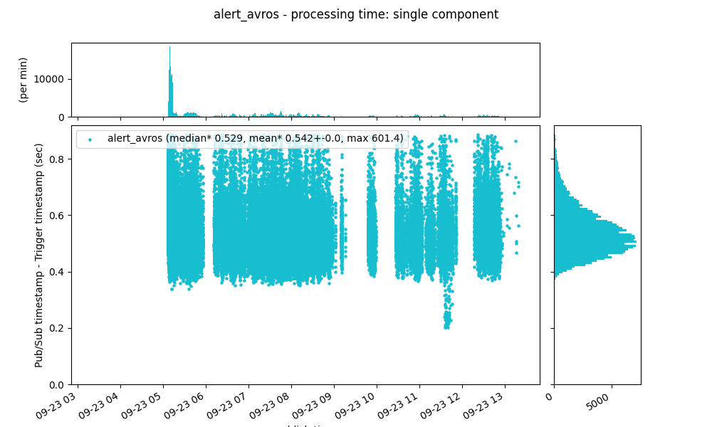

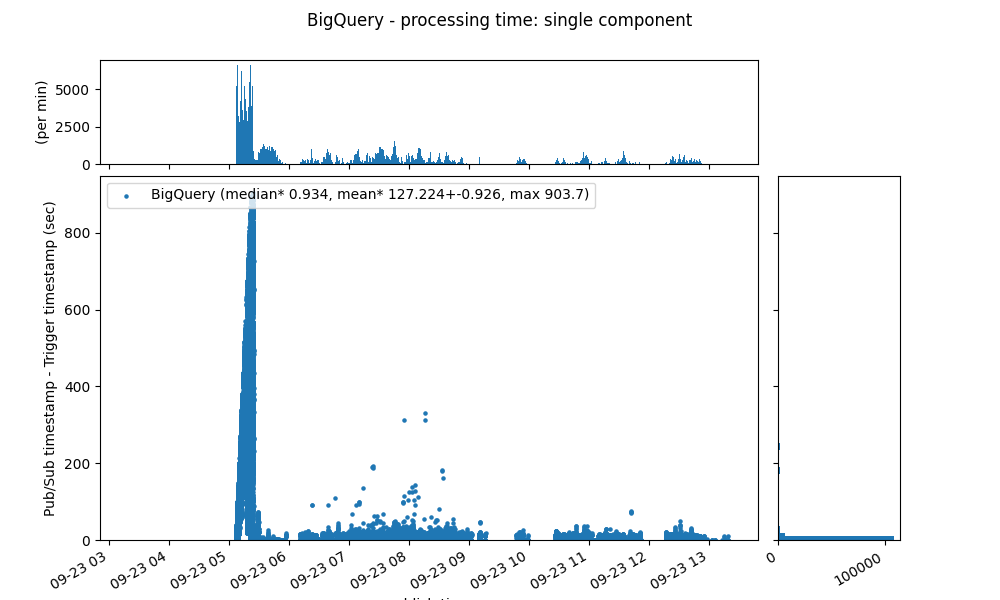

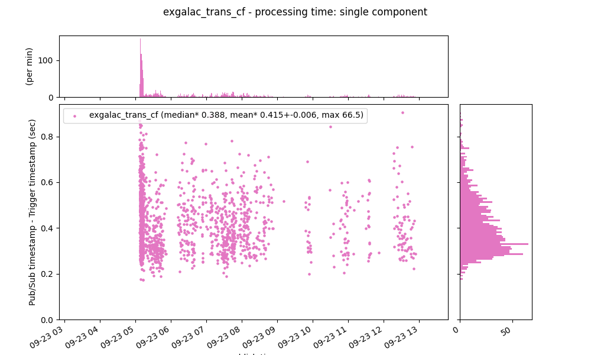

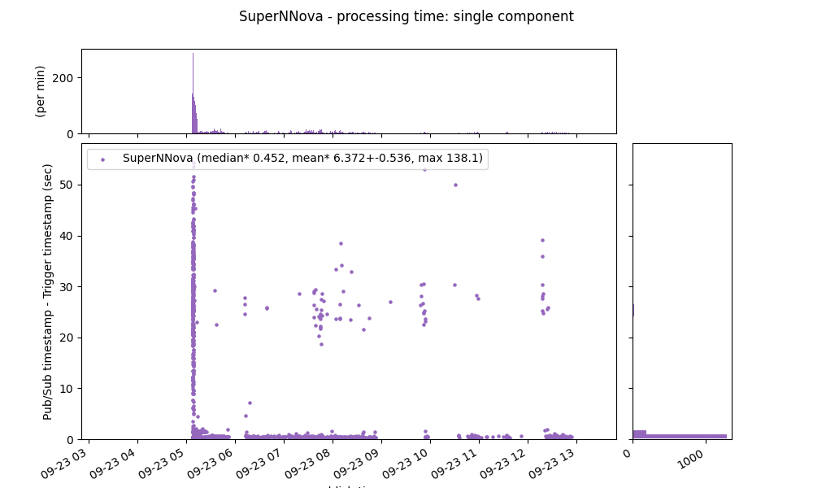

__Code to produce plots:__
```python
import figures as figs

query = {
    'survey': 'ztf',
    'testid': False,
    'date': '20210923',
    # 'limit': 100,
    'columns': [
                    'kafka_timestamp__alerts',
                    'publish_time__alerts',
                    'publish_time__BigQuery',
                    'publish_time__alert_avros',
                    # 'publish_time__AllWISE',
                    # 'publish_time__alerts_pure',
                    'publish_time__exgalac_trans_cf',
                    'publish_time__SuperNNova',
                ]
}
savefig_dir = 'figures/20210923'
mplot = figs.MetadataPlotter(query=query, savefig_dir=savefig_dir)
# mplot = figs.MetadataPlotter(df=mplot.df, query=query, savefig_dir=savefig_dir)

# plot processing times with marginal histograms
cols = ['alerts', 'BigQuery', 'alert_avros', 'exgalac_trans_cf', 'SuperNNova']
clip_first = 0
for c in cols:
    for tref in ['Kafka', 'Trigger']:
        plot_proct()

def plot_proct():
    fig = plt.figure()
    gs = fig.add_gridspec(2, 2,  width_ratios=(7, 1.3), height_ratios=(2, 7),
                          left=0.1, right=0.9, bottom=0.1, top=0.9,
                          wspace=0.05, hspace=0.05)

    ax = fig.add_subplot(gs[1, 0])
    marg_ax = {
        'x': fig.add_subplot(gs[0, 0], sharex=ax),
        'y': fig.add_subplot(gs[1, 1], sharey=ax),
    }
    mplot.plot_proc_time(c, ax, tref=tref, clip_first=clip_first, marg_ax=marg_ax)
    fig.autofmt_xdate()
    if tref == 'Kafka':
        title = f"{c.split('__')[-1]} - processing time: cumulative"
    elif tref == 'Trigger':
        title = f"{c.split('__')[-1]} - processing time: single component"
    fig.suptitle(title)
    mplot._save_or_show(f'{c}-{tref}')
    if mplot.savefig_dir is not None:
        plt.close(fig)
```

## Cloud Function execution

Takeaways:
- The execution time of an individual Cloud Function instance is higher when there are more simultaneous instances (i.e., incoming alert rate is higher). This seems strange to me. But it does explain the 10x billing increase (lots of instances with long execution times).
- The Cloud Functions that store to BigQuery (*BigQuery* and *SuperNNova*) experience a large number of timeouts (which then get retried) when the incoming rate is high. I assume we are hitting a rate limit for streaming inserts, but I haven't checked.

__Figures__

[Left] Execution times. [Right] Execution results - ok vs. timeout

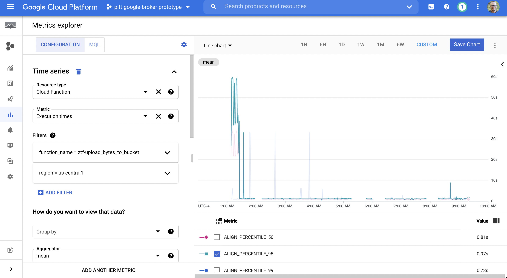 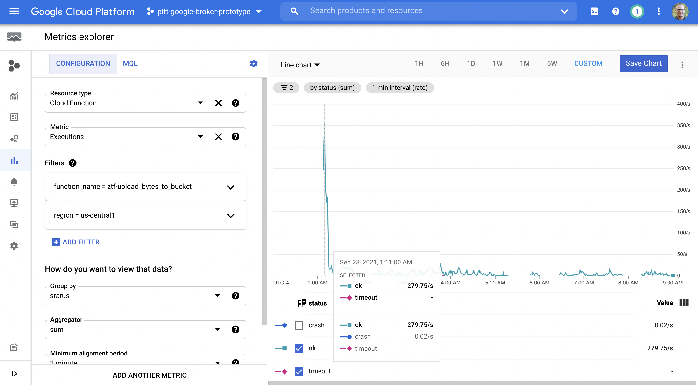

*alert_avros*

 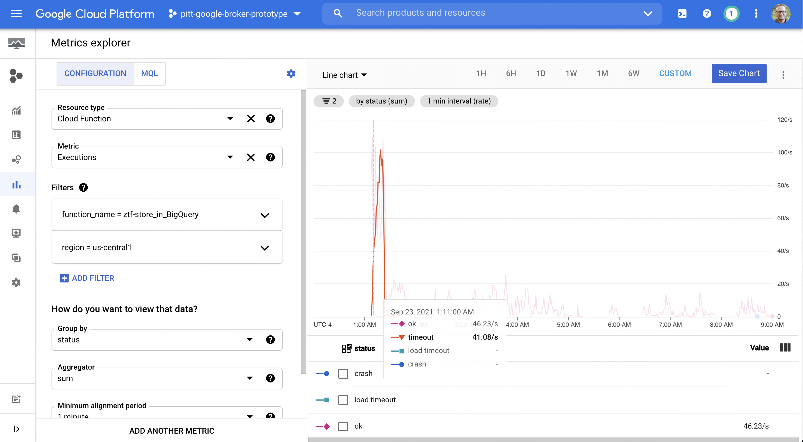

*BigQuery*

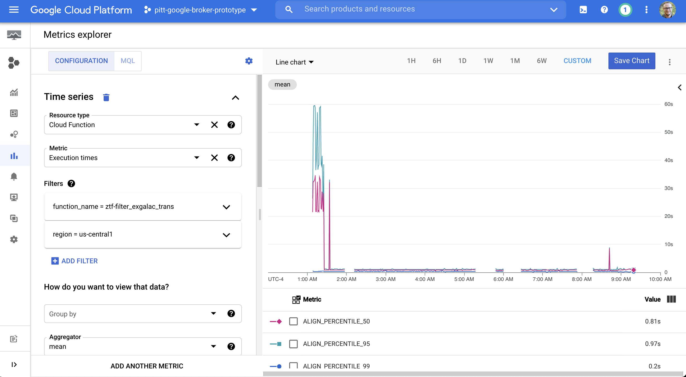 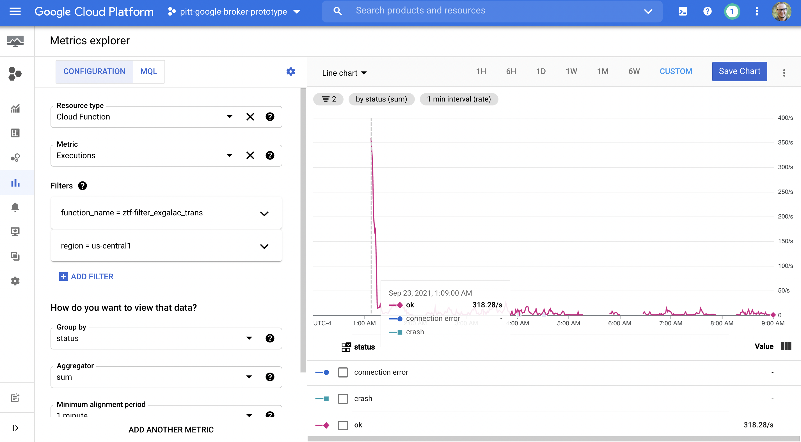

*exgalac_trans_cf*

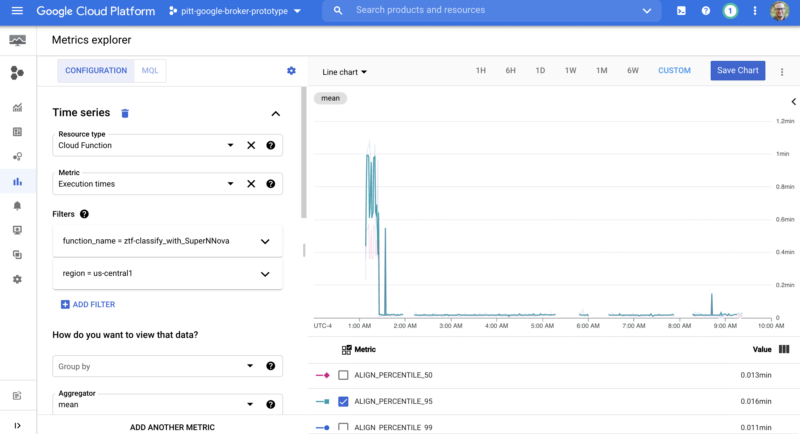 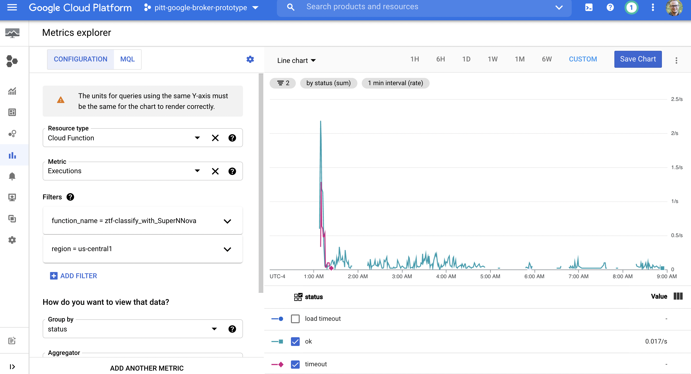

*SuperNNova*

## Billing

Takeaways:
- The combination of many simultaneous Cloud Function instances and their large execution times results in high costs (>6x normal ZTF).

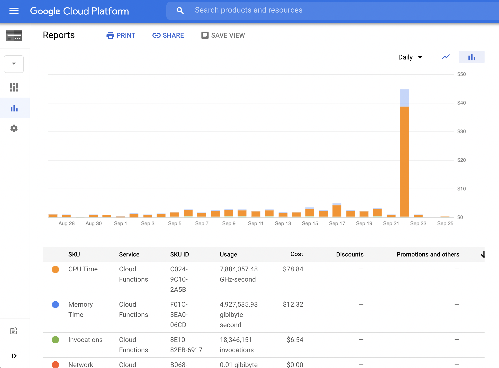
