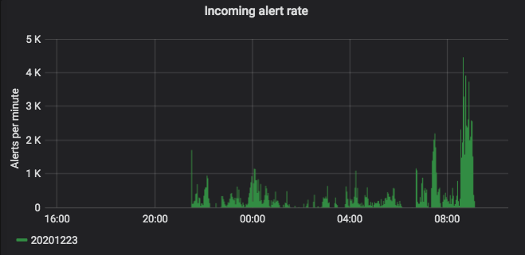
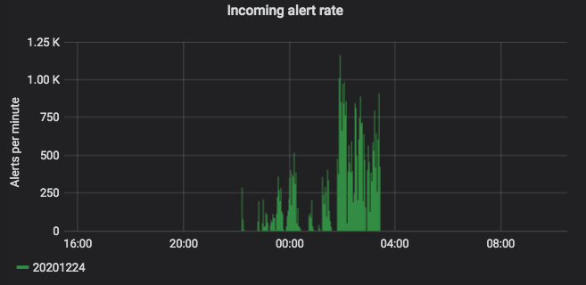
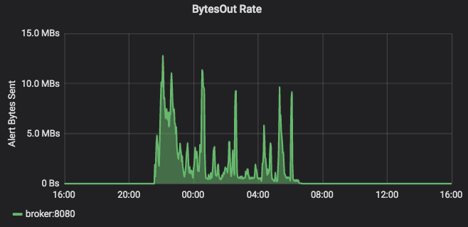
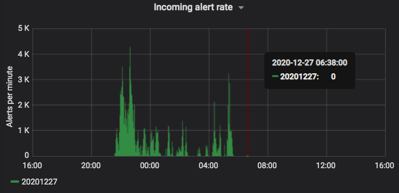
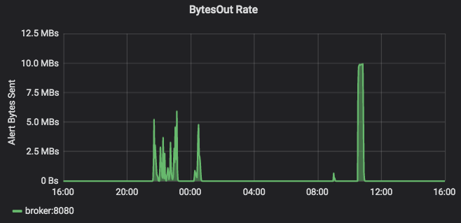
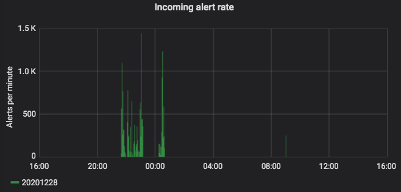

- [`ZTF Stream` Dashboard](https://console.cloud.google.com/monitoring/dashboards/builder/090d10a0-f661-4768-831f-30c67dab50bf?project=ardent-cycling-243415&dashboardBuilderState=%257B%2522editModeEnabled%2522:false%257D&timeDomain=1w)

- [Google Cloud metrics](https://cloud.google.com/monitoring/api/metrics_gcp)
- [Metrics, time series, and resources](https://cloud.google.com/monitoring/api/v3/metrics)
- [Creating custom metrics](https://cloud.google.com/monitoring/custom-metrics/creating-metrics#monitoring_write_timeseries-python)

# ToC
- [Dec 22-24, 2020](#dec24)
- [Dec 27, 2020](#dec27)
- [Dec 28, 2020](#dec28)
- [Dec 30, 2020](#dec30)
- [Code Snippets](#code)

---

<a name="dec24"></a>
# Dec 22-24, 2020
<!-- fs -->
- Consumer: custom consumer, running on Compute Engine VM
    - kafka installed with:
        - `conda install -c conda-forge kafka-python -y`
        - `conda install -c conda-forge python-confluent-kafka -y`
        - `conda install -c stuarteberg -c conda-forge librdkafka -y`
- GCS Avro storage: handled by the custom consumer (above)
- BigQuery storage: PS -> BQ Dataflow job, `ztf-beam.py`
- Processing: Dataflow job `ztf-beam.py` (BQ, exgal transients, Salt2)

On the 24th, 3 consumer VMs were running simultaneously, processing different topics (days).

| Day | # alerts produced by ZTF | # Avros in GCS |
|:---:|:---:|:---:|
| Dec 22 | 334,996 | 329,547 |
| Dec 23 | 234,522 | 230,626 |
| Dec 24 | 71,144 | 29,072 |




ZTF dashboard snapshots.


CPU utilization of Consumer VMs.
- __Dec 22 VM (orange)__ was started at 11am on Dec 22 (live stream was over, but it should have seeked to the earliest alert in the topic); doesn't start ingesting until Dec 23 at 10am.
- __Dec 23 VM (purple)__ was started at 12:15am, ingested sporadically until 7am, then consistently for >24 hrs.
- __Dec 24 VM (green)__ was started at 12:20am, ingested until 4:30am (last alert generated by ZTF at 3:40am), ingested 40% of the ZTF alerts (based on number of Avros in GCS).


This is a metric I created to count the number of logs generated (per VM) stating an alert is being ingested.
- Dec 22 (orange)
- Dec 23 (red). The color scheme + transparency is really bad; the line segment that looks orange prior to 10am on the 23rd is in fact the Dec 23 (red) line.
- Dec 24 (green)


Messages successfully published to PS topic `ztf_alert_data` (blue); failed messages (orange). ("Cumulative count of publish message operations, grouped by result.")


- [left] Messages successfully published to PS topic `ztf_alert_avro_bucket` (blue; generated automatically by the bucket when a new file is added).
- [right] Dataflow elements read from PS topic `ztf_alert_data`.


- [left] Dataflow worker(s) CPU utilization (# lines = # workers; stacked)
- [right] Dataflow: "maximum duration that an item of data has been processing or awaiting processing".

<!-- fe Dec 24, 2020 -->

<a name="dec27"></a>
# Dec 27, 2020
<!-- fs -->
- [New] Consumer: Kafka -> PS Connector
    - started consumer when there were
     (based on new PS messages)
- [New] GCS Avro storage: PS -> GCS Cloud Function
- BigQuery storage: PS -> BQ Dataflow job, `ztf-beam.py`
- Processing: Dataflow job `ztf-beam.py` (BQ, exgal transients, Salt2)

| Day | # alerts produced by ZTF | # `ztf_alert_data` PS msgs | # Avros in GCS |
|:---:|:---:|:---:|:---:|
| Dec 27 | 288,533 | 577,066 (288,533 x2) | 283,911 |




ZTF dashboard for Dec 27, 2020.


- Connector started at 12:05am when ZTF had already generated ~177,800 alerts.
Ingests the backlog in >20 min; seems to keep up with ZTF for the rest of the night.
- By 6am, `ztf_alert_data` PS topic has 288,533 new messages, same as number of alerts generated by ZTF. Using previous, custom consumer, ingesting this many alerts took >24 hrs.
- At 10am connector ingests a large burst of alerts not reflected in ZTF output.
- Between 10-10:30am, `ztf_alert_data` PS topic gets an additional 288,533 new messages.
- I think the stream must replay at 10am (I have previously noticed several of the custom consumer VMs suddenly begin ingesting a couple of minutes after 10am.)


- GCS Avro bucket storage and Dataflow PS read keep up with the live stream.
- After ingesting original backlog, Dataflow system lag increases to a max of ~80 min; afterwards hits max of ~10 min during original ingestion.
- After re-ingesting the full night's worth of alerts in ~30 min, Dataflow system lag reaches ~6 hrs 10 min.

<!-- fe Dec 27, 2020 -->


<a name="dec28"></a>
# Dec 28, 2020
<!-- fs -->
- Consumer: Kafka -> PS Connector
- GCS Avro storage: PS -> GCS Cloud Function
- BigQuery storage: PS -> BQ Dataflow job, `ztf-beam.py`
- Processing: Dataflow job `ztf-beam.py` (BQ, exgal transients, Salt2)

| Day | # alerts produced by ZTF | # `ztf_alert_data` PS msgs | # Avros in GCS |
|:---:|:---:|:---:|:---:|
| Dec 28 | 34,273 | 34,273 | 34,051 |




ZTF dashboard for Dec 28, 2020.
Bytes out burst at the end starts at about 10:30am.


Consumer is shutdown just before 10am and is not online during the ZTF bytes out burst; however, PS msg count matches number of ZTF alerts, so we seem to have ingested everything.


Max system lag is about 10 min.

<!-- fe Dec 28, 2020 -->


<a name="jan1"></a>
# Jan 01, 2021
<!-- fs -->
Dataflow job looked fine (re-ingested at 10am) except for data freshness increased to almost 22 hrs.
Stopping the job to start fresh for Jan 2.

- Consumer: Kafka -> PS Connector
- GCS Avro storage: PS -> GCS Cloud Function
- BigQuery storage: PS -> BQ Dataflow job, `ztf-beam.py`
    - [New] dropped `batch_size` from BQ upload configs.
    Now using default of 500.
    Old `batch_size`s were 5000 for full alert table, 50 for salt2 table.
    - [Testing] Dataflow job from template: `ztf-ps-to-bq`
        - writing alert data to BQ table `dataflow_test.ztf_alerts_dec29`
- Processing: Dataflow job `ztf-beam.py` (BQ, exgal transients, Salt2)

| Day | # alerts produced by ZTF | # `ztf_alert_data` PS msgs | # Avros in GCS |
|:---:|:---:|:---:|:---:|
| Jan 01 |  |  |  |


ZTF dashboard for Jan 01, 2021.


<!-- fe Jan 01, 2021 -->


<a name="code"></a>
# Code Snippets
<!-- fs -->
__count the number of objects in the bucket matching day's topic__
```bash
day=20201227  # yyyymmdd
fout=dec27.count
# list files matching day's topic > stash in a file
gsutil ls gs://ardent-cycling-243415_ztf_alert_avro_bucket/ztf_${day}_programid1_*.avro > ${fout}
# count the files
wc -l ${fout}
```

<!-- fe Code Snippets -->
